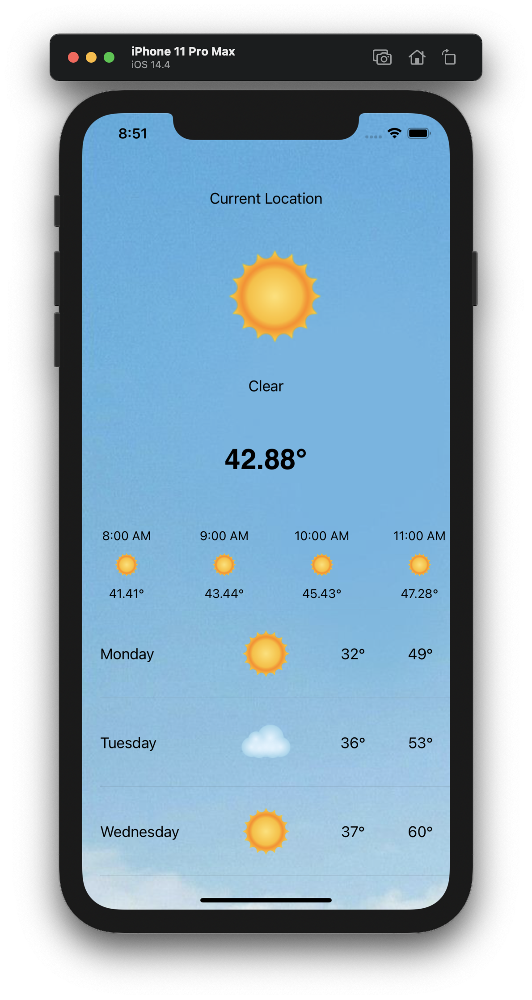

# My Weather

A simple weather app with api [Dark Sky](https://darksky.net/)

## Features 
* Current location weather information
* Weather information per hour
* Weather information every day

## API 
* [Dark Sky](https://darksky.net/)

## Screen Shot

## Development team
* [Phuc Tran Ba](https://github.com/phuctranba)

## Development purpose
Personal projects
